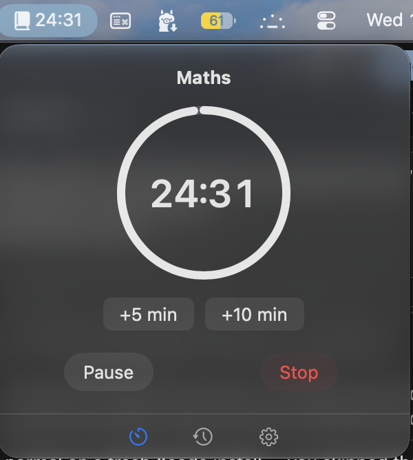

# StudyBar

<p align="center">
  
</p>

A native macOS menu bar study timer. Pick a subject, start a session, and the menu bar icon becomes a live countdown with a progress ring. Fully local — no accounts, no cloud, no network.



## Features

- **Menu bar native** — lives in the menu bar only (no dock icon, no main window)
- **Live countdown** — icon morphs to `mm:ss` + animated progress ring while studying
- **Subjects & topics** — editable lists, persisted with SwiftData
- **Duration presets** — 25 / 50 / 90 min, or custom
- **Session controls** — pause, resume, stop early, extend +5 / +10 min
- **Notifications** — alerts when a session starts and completes
- **History** — today / week / month / daily-average totals, per-subject breakdown
- **Settings** — launch at login, sound on session end, manage subjects, quit

**Requirements:** macOS 14.0 (Sonoma) or later · Apple Silicon or Intel

## Install

> **Important:** use the **[Releases](https://github.com/IMisbahk/studybar/releases)** page.
> Do **not** use GitHub's green **Code → Download ZIP** button — that downloads the **source code**, not the app.

### Option 1 — Direct download (recommended)

**[Download StudyBar.zip](https://github.com/IMisbahk/studybar/releases/latest)** (from Releases)

1. Download `StudyBar-x.y.z.zip` from the [Releases](https://github.com/IMisbahk/studybar/releases/latest) page
2. Double-click the zip to extract — you'll see **`StudyBar-x.y.z.dmg`** inside (not the repo, not source files)
3. Double-click the `.dmg` to open it
4. Drag **StudyBar.app** to your **Applications** folder
5. Launch StudyBar — click the **book icon in the menu bar** (top right). There is **no Dock icon**; the app only lives in the menu bar.

### First launch — macOS may block the app (one time)

StudyBar isn't notarized (that costs $99/year). macOS may warn that the app "can't be checked for malicious software." **Normal for indie Mac apps.**

**Do this once:**

1. In Finder, go to **Applications**
2. **Right-click** `StudyBar.app` → **Open**
3. Click **Open** in the dialog

After that, double-click works. You don't need System Settings unless you want **Privacy & Security → Open Anyway** instead.

**Or use the install script** — it strips quarantine for you:

```bash
curl -fsSL https://raw.githubusercontent.com/IMisbahk/studybar/main/scripts/install-release.sh | bash
```

**Or Terminal:** `xattr -cr /Applications/StudyBar.app`

**In-app updates (v1.5.3+):** Settings → Download Update → **Restart to Update**. StudyBar quits, installs, and reopens automatically. Install to `/Applications` for this to work.

You can also download `StudyBar-x.y.z.dmg` directly from Releases if you prefer to skip the zip step.

Verify checksum (optional):

```bash
shasum -a 256 -c StudyBar-1.0.0.sha256
```

### Option 2 — Install script (latest release)

```bash
curl -fsSL https://raw.githubusercontent.com/IMisbahk/studybar/main/scripts/install-release.sh | bash
```

Or pin a version:

```bash
curl -fsSL https://raw.githubusercontent.com/IMisbahk/studybar/main/scripts/install-release.sh | bash -s -- 1.0.0
```

### Option 3 — Homebrew (local cask)

```bash
brew install --cask ./packaging/homebrew/StudyBar.rb
```

> After each new release, update `version` and `sha256` in `packaging/homebrew/StudyBar.rb` (see [docs/RELEASING.md](docs/RELEASING.md)).

### Option 4 — Build from source

```bash
git clone https://github.com/IMisbahk/studybar.git
cd studybar
./scripts/install-from-source.sh
```

Or build without installing:

```bash
./scripts/build.sh Release
open build/Build/Products/Release/StudyBar.app
```

Full details: [docs/INSTALL.md](docs/INSTALL.md)

## Quick start

1. Click the **book icon** in the menu bar
2. Add a subject (+ button), pick a duration, tap **Start Session**
3. Allow notifications when macOS asks
4. Click the icon again during a session for pause / stop / extend
5. Check **History** and **Settings** via the bottom tab bar

## Development

```bash
git clone https://github.com/IMisbahk/studybar.git
cd studybar
xcodebuild -runFirstLaunch   # once, after installing Xcode
./scripts/build.sh Debug
open build/Build/Products/Debug/StudyBar.app
```

See [docs/DEVELOPMENT.md](docs/DEVELOPMENT.md).

## Versioning & releases

StudyBar uses [Semantic Versioning](https://semver.org/). The canonical version lives in [`VERSION`](VERSION). [CHANGELOG.md](CHANGELOG.md) tracks all releases.

| Artifact | What's inside |
|----------|---------------|
| `StudyBar-x.y.z.zip` | **Only** `StudyBar-x.y.z.dmg` — unzip → open dmg → drag app to Applications |
| `StudyBar-x.y.z.dmg` | Same dmg, for direct download without the zip wrapper |
| `StudyBar-x.y.z.sha256` | SHA-256 checksums for zip + dmg |

Releases are built automatically when a `v*` tag is pushed. Maintainer guide: [docs/RELEASING.md](docs/RELEASING.md).

## Project layout

```
StudyBar/           Swift source (Models, Core, Views)
StudyBar.xcodeproj/ Xcode project
scripts/            build, package, install, version bump
packaging/          Homebrew cask
docs/               install, development, releasing guides
.github/workflows/  CI + release automation
```

## Privacy

All data stays on your Mac. SwiftData stores subjects, topics, and session history locally. No analytics, no network calls.

## License

[MIT](LICENSE) © Misbah Khursheed

## Contributing

Issues and PRs welcome. See [PRODUCT.md](PRODUCT.md) for the product spec and non-goals.
